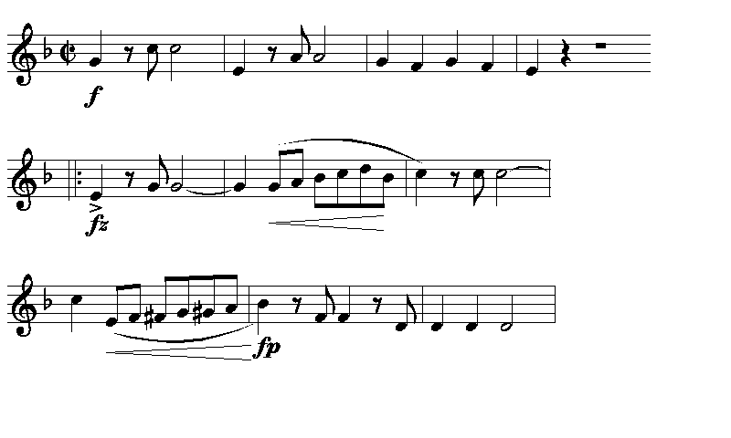
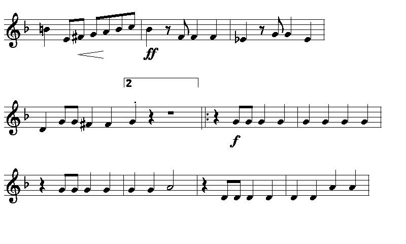

# CrossPoint Music

CrossPoint Music is open-source e-reader firmware that displays sheet
music, reformatted to fit the screen one measure at a time rather than
shown as a fixed page image.

**Now running on:** ESP32C3-based Xteink [X4](https://www.xteink.com/products/xteink-x4).

It is made for individual part sheet music, read on-instrument: one voice,
one staff. Page turns follow the music, so at a repeat the next page takes
you back to the right measure, and the second time through you get the
second house. The device remembers your place in each piece, and the
notation size can be changed while you read.



## Can I use this today?

The music side is under active development; it runs in the desktop
simulator and hardware testing is next. You need an Xteink device, a
microSD card, and `.cpmx` music files, converted from MusicXML or PDF with
the command-line tools described below. The device still works as a normal
e-book reader; this firmware adds music on top.

## What the viewer does



- Measure-aware reflow at six staff sizes, from XX Small to X Large. Pick
  one in settings, or cycle them with the Confirm button while reading.
- Page turns follow the music, not the paper. The converter resolves
  repeats and voltas ahead of time, so paging forward always shows what
  you play next. You still see the notation as engraved, repeat signs and
  volta brackets included, so you know where you are in the form.
- Ties and slurs split correctly at line breaks, with both halves
  pre-engraved so the device never draws an awkward half-curve.
- Each piece opens on a cover page: title, composer and arranger from the
  file's metadata. In a setlist the cover marks the boundary between
  pieces and shows where you are in the order.
- The device saves your place in each piece and takes you back there when
  you reopen it.
- Landscape is the default orientation in this fork. Scores read better
  that way.

## Setlists

A gig has an order, so the reader supports setlists: a `.cpsl` file is a
plain text list of `.cpmx` paths, one per line (`#` comments allowed,
paths relative to the setlist's folder or absolute, up to 64 pieces —
entries beyond that are ignored with a log message). Open it like a book
and the reader flows through the pieces — paging past the end of one march
lands on the first page of the next, and paging back from a piece's first
page returns to the previous piece's last page. A setlist always starts
from the top: a rehearsal or gig begins at the first piece, so no position
is remembered. Keep one file per standard order ("street parade",
"drill show") and switch by opening the other file.

## Getting music onto the device

The device reads `.cpmx` files, produced from MusicXML (which MuseScore,
Dorico and most notation programs export) or from PDFs via optical music
recognition.

Conversion is command-line only for now, described below. The plan is a
desktop sheet music library app with conversion and device sync built in:
import your PDFs and MusicXML files, let the library convert them, and sync
your music to the device, the way Calibre with the CrossPoint plugin works
for books. The files are small — a full 92-measure march is 12.7 KB.

## How it works

Music has a property text already exploits: it wraps. Line breaks happen
between measures, exactly like text breaks between words. If every measure
arrives pre-engraved as a self-contained unit with a known width, the device
only needs to pack measures into lines. That is the same job the EPUB engine
already does with words.

So the heavy lifting happens offline, and the firmware stays small:

```
PDF ──OMR──> MusicXML ──converter──> .cpmx ──SD card──> firmware viewer
                          (Verovio)
```

The offline converter is desktop Python. It renders MusicXML with
[Verovio](https://www.verovio.org/), harvests the engraving into per-measure
primitives, and emits `.cpmx`. PDFs go through
[Audiveris](https://audiveris.github.io/audiveris/) OMR first.

The viewer on the device streams measures from SD one record at a time,
packs them into systems, and blits pre-rasterized
[Bravura](https://github.com/steinbergmedia/bravura) glyphs. The ESP32-C3
has 380 KB of RAM and never does any engraving math.

## Converting music (command line, for now)

You need Python 3 and the converter directory:

```bash
cd converter
python3 -m venv .venv
.venv/bin/pip install -r requirements.txt

# From MusicXML (exported from MuseScore, Dorico, etc.)
.venv/bin/python extract.py mypiece.musicxml
.venv/bin/python cpmx_emit.py out/mypiece.primitives.json
# -> out/mypiece.cpmx  — copy it to the SD card and open it like a book
```

For PDFs, run [Audiveris](https://audiveris.github.io/audiveris/) first to
get MusicXML. Two practical notes from converting real parts: rasterize at
300 DPI, because key signatures get misread at lower resolutions (Audiveris
caps input at 20 Mpx, so crop large pages down to their content), and expect
to correct the occasional OMR misread in the MusicXML before converting.
The extractor warns about suspicious content, such as chords in a part that
should be monophonic, to point you at what needs fixing.

How faithful the conversion is, and the tooling for verifying it, is
covered in [converter/README.md](converter/README.md).

## Developing without a device

The [crosspoint-simulator](https://github.com/crosspoint-reader/crosspoint-simulator)
runs the whole firmware natively in an SDL2 window:

```bash
brew install sdl2        # or apt install libsdl2-dev
pio run -e simulator && .pio/build/simulator/program
```

The simulated SD card is `./fs_/`. Arrow keys page, Enter cycles staff size,
Esc goes back. Two environment variables help with visual testing:
`CROSSPOINT_MUSIC_SHOT=1` dumps every rendered page as BMP to
`fs_/screenshots/`, and `CROSSPOINT_MUSIC_AUTOPAGE=1` pages through the
whole piece by itself.

## Where things live

| Path | What |
|---|---|
| [docs/music/PLAN.md](docs/music/PLAN.md) | Project plan, decisions, status |
| [docs/music/cpmx-format-draft.md](docs/music/cpmx-format-draft.md) | The frozen `.cpmx` v2 binary format spec |
| [converter/](converter/README.md) | MusicXML → primitives → `.cpmx` pipeline |
| [lib/Cpmx/](lib/Cpmx/CpmxReader.h) | Firmware-side format reader |
| [src/activities/reader/MusicReaderActivity.cpp](src/activities/reader/MusicReaderActivity.cpp) | The viewer |

## Roadmap

Single staff, single voice is deliberate: this firmware is for individual
parts, not full scores. On the roadmap in
[PLAN.md](docs/music/PLAN.md): hardware verification, D.C./D.S. al Fine
jumps, text under the staff (drill cues), OMR correction tooling, and the
sheet music library app mentioned above.

## Relationship to upstream

This is a fork of
[CrossPoint Reader](https://github.com/crosspoint-reader/crosspoint-reader),
the open-source e-reader firmware for the Xteink X4. The fork tracks
upstream (`git fetch upstream`) and keeps its e-book functionality intact:
EPUB, TXT, wireless transfer, OPDS and themes all still work. The music
work is not intended as an upstream PR; it lives here. For everything
inherited from upstream (building, flashing, the unlocker for USB-locked
devices, wireless features, contributing), see the
[upstream README](https://github.com/crosspoint-reader/crosspoint-reader).

Music glyphs come from [Bravura](https://github.com/steinbergmedia/bravura)
(SIL OFL). Verovio (LGPL) and Audiveris (AGPL) run on the desktop only;
nothing of them ships in the firmware.
